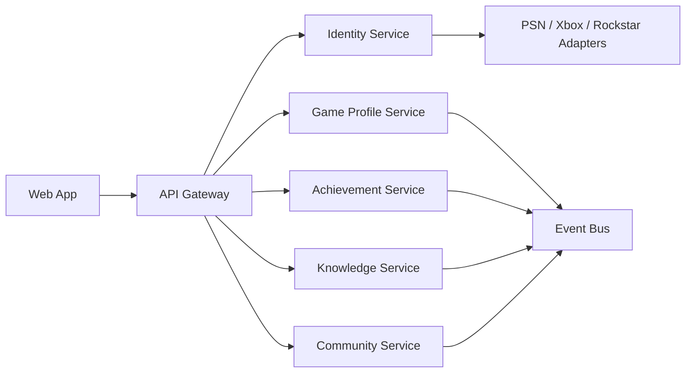

# Architecture

## High-Level Shape

## Service Boundaries

- API Gateway: public API facade, aggregation, future auth enforcement,
  rate-limiting, and versioning.
- Identity Service: users, preferences, consent, linked account intents, OAuth
  provider boundaries.
- Game Profile Service: player handles, platforms, characters, money snapshots,
  crew status, and progression summaries.
- Achievement Service: trophy/achievement catalog, user progress, completion
  statistics, and seasonal objectives.
- Knowledge Service: guides, news, wiki entries, patch notes, map items, and
  contribution workflow.
- Community Service: posts, events, crews, reactions, reports, and moderation
  queue.

## Data Strategy

For production, each service should own its database. The first deployable
foundation uses in-memory seed data to keep local development friction low. The
intended production path is:

- PostgreSQL per service for transactional data.
- Redis for caching, sessions, and rate limits.
- Object storage for media and map assets.
- Event streaming through RabbitMQ, NATS, or Kafka.
- OpenTelemetry for distributed tracing.

## API Strategy

- Public routes are exposed through the gateway under `/api`.
- Service routes remain internal in Docker networks.
- Versioning should use `/api/v1` once contracts stabilize.
- Public account-linking routes must never store external credentials directly.

## Deployment Strategy

The platform is designed to move from Docker Compose to Kubernetes:

- Local: Docker Compose.
- Staging: Compose or managed container apps.
- Production: Kubernetes, managed databases, managed secrets, CDN, WAF, and
  centralized observability.
